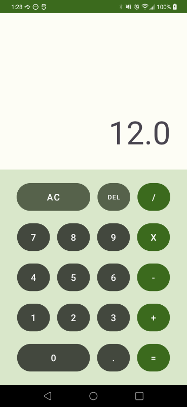
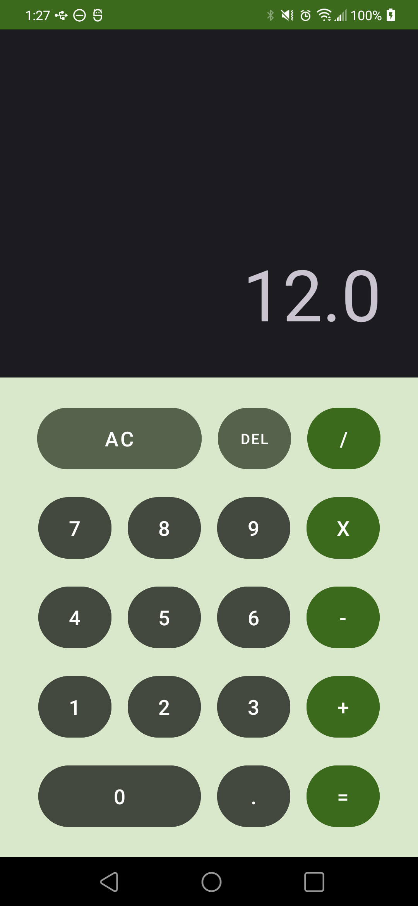

> **Completed for MOBI3002: Mobile Application Development Assignment**
>
> Lauren MacDonald, November 2023
>
> **Languages/Concepts**: Android Application Development, Java

## Calculator Mobile Application

Simple calculator mobile application that takes user input from UI and presents result. Loosely based on existing 
calculator applications.

- Builds calculation from user button clicks with functionality for addition, subtraction, multiplication,
division.
- Can clear calculation, delete part of a calculation, take decimal input. Displays calculation result.
- Simple error handling is used (i.e., divide by 0).

Developed using Android Studio with Java, demonstrating UI design and development with Views in the 
Layout Editor XML file. 

> **Current To Dos:**
> - Use layout variants to optimize for different screen sizes, including landscape
> - Add error handling for size of number as app crashes when the number is too large
